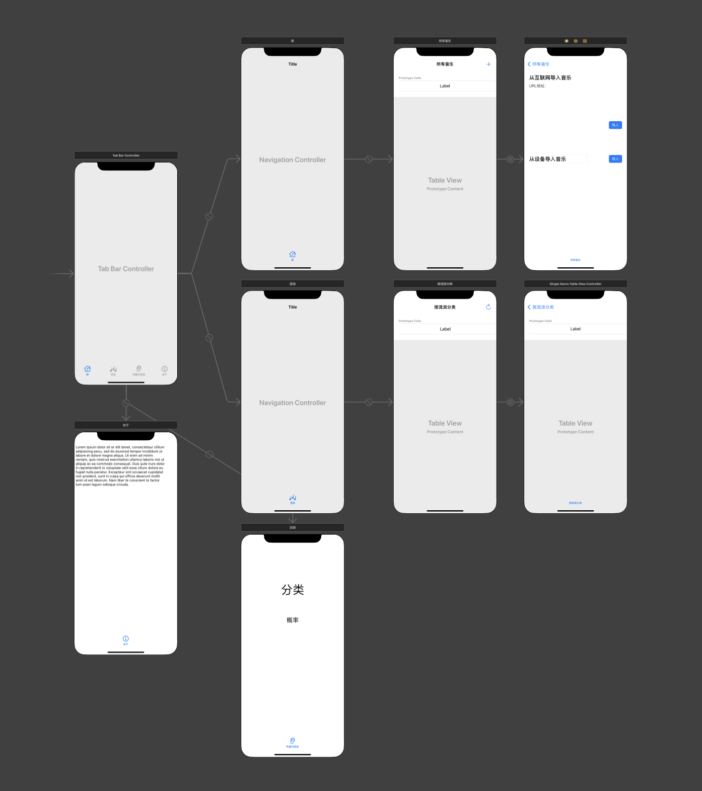
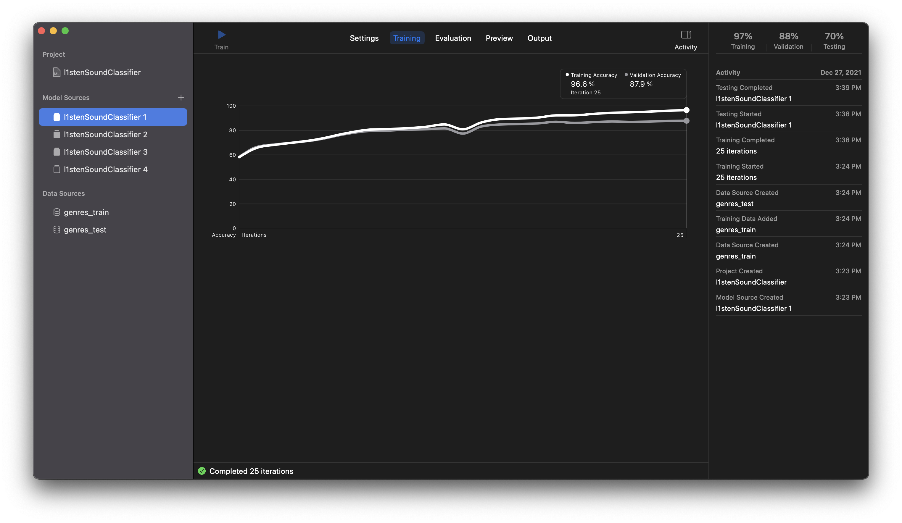
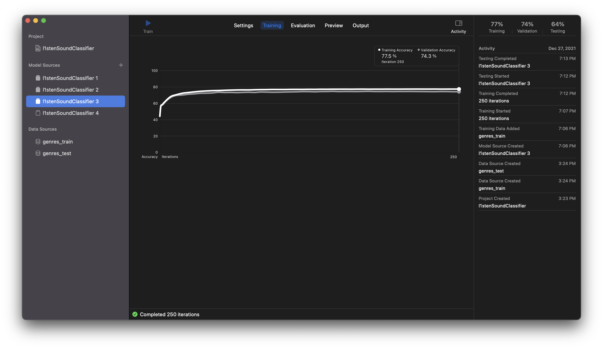

# Final Project - 听见 l1stener

> 191180164 杨茂琛

基于Core ML实现的Sound Classifier，数据持久化的支持统一的音乐识别、管理及播放的现代音乐应用

演示视频：[Bilibili](https://www.bilibili.com/video/BV1Dm4y1D7Wd/)

## Feature一览

- 基于Core ML训练的音频识别模型
- 识别达10种音乐流派
- 导入音乐（无论在设备上还是在互联网）
- 基于Core Data实现的数据持久化
- 播放音乐
- 音乐按流派分配
- 实时识别麦克风输入音频的流派

## UI设计

### 思路



底层controller为tab bar controller。各tab页内如有navigation需求则增加navigation controller形成tab bar controller -> navigation controller -> table view controller


使用tab bar controller可以很优美、轻松地将几个应用场景分离；使用navigation controller可以方便地实现navigation无需操心细节；使用table view controller显示列表无需花费太多心思即可获得很不错的排版效果并实现交互功能

### 实现细节

1. 重写`didSelectRow`方法实现点击播放：

```swift
    override func tableView(_ tableView: UITableView, didSelectRowAt indexPath: IndexPath) {
        do {
            audioPlayer = try AVAudioPlayer(data: coreDataConnect.getMusic(fileName: allMusic[indexPath.row].fileName!))
            audioPlayer.delegate = self
            audioPlayer.prepareToPlay()
            audioPlayer.play()
        } catch {
            print(error.localizedDescription)
        }
    }
```

2. 重写`viewWillDisappear`方法实现切换tab页停止🤚播放：

```swift
    override func viewWillDisappear(_ animated: Bool) {
        audioPlayer.pause()
    }
```

3. 重写`commit editingStyle`方法实现向左滑动删除：

```swift
    override func tableView(_ tableView: UITableView, commit editingStyle: UITableViewCell.EditingStyle, forRowAt indexPath: IndexPath) {
        if coreDataConnect.delete(fileName: allMusic[indexPath.row].fileName!) {
            allMusic = coreDataConnect.getAll()
            self.tableView.reloadData()
        }
    }
```

这些小技巧基本都在前面的T0Do中使用过，翻照commit记录参考实现就行啦

## 模型

### 训练

使用了数据集https://www.kaggle.com/andradaolteanu/gtzan-dataset-music-genre-classification

我将原始数据集按照8:2比例划分为train set和test set，修改后的数据集可在box下载：https://box.nju.edu.cn/f/824f01929b504dcababa/?dl=1



最终使用的模型是VGGish的feature extrator。

使用了一下新的extrator即Audio Feature Print确实体积小一些（或许确实更适合实际应用场景），但是准确率实在是太差劲：



### 使用

Sound Classification使用起来其实和Image Classification很像！

首先，需要导入识别器；然后示例化一个识别器，取出其中的模型`model`以供使用；定义处理分析结果的方法即RequestObserver，它至少需要实现以下方法：

```swift
    func request(_ request: SNRequest, didProduce result: SNResult) {
				// code here
    }
    
    func request(_ request: SNRequest, didFailWithError error: Error) {
        print("The the analysis failed: \(error.localizedDescription)")
    }
    
    func requestDidComplete(_ request: SNRequest) {
        print("The request completed successfully!")
    }
```


coreml为开发者封装了两个类来分别处理静态文件和实时音频流：

1. 使用`SNAudioFileAnalyzer`来分析文件

比较无语的是它只支持wav格式。我尝试在其文档中寻找对格式的相关说明但没找到（除了示例用到了wav），试了一些常见格式好像就wav可行

```swift
                // 开始识别
                self.audioFileAnalyzer = try SNAudioFileAnalyzer(url: savedURL)
                let resultsObserver = ResultsObserver()
                do {
                    let request = try SNClassifySoundRequest(mlModel: self.model)
                    try self.audioFileAnalyzer.add(request, withObserver: resultsObserver)
                } catch {
                    print(error.localizedDescription)
                }
                self.audioFileAnalyzer.analyze()
```

2. 使用`SNAudioStreamAnalyzer`分析流

```swift
        let inputFormat = self.audioEngine.inputNode.inputFormat(forBus: 0)
        streamAnalyzer = SNAudioStreamAnalyzer(format: inputFormat)

        do {
            let request = try SNClassifySoundRequest(mlModel: model)
            try streamAnalyzer.add(request, withObserver: resultsObserver)
        } catch {
            print(error.localizedDescription)
        }
        
        self.audioEngine.inputNode.installTap(onBus: 0, bufferSize: 8192, format: inputFormat) { buffer, time in
            self.analysisQueue.async {
                self.streamAnalyzer.analyze(buffer, atAudioFramePosition: time.sampleTime)
            }
        }
        
        do {
            try self.audioEngine.start()
        } catch {
            print(error.localizedDescription)
        }
```

需要比较注意的是，需要配置好识别的相关设置，最后再启动音频设备audioEngine


## 数据持久化

用了Core Data才发现数据持久化真的是一件非常简单的事情！它有以下让我惊呼好家伙的优点：

1. 无需（或者无需太多）数据库知识
2. 无需额外对其管理，尽情使用即可
3. 对于过大的二进制文件，自动抉择存放位置无需人工干预

我将对core data的操作抽象成类`CoreDataConnect`方便各controller使用：

```swift
class CoreDataConnect {  
    init(context:NSManagedObjectContext) {
        self.myContext = context
    }
    
    // insert
    func insert(data: Data, fileName: String, genre: String) -> Bool {

    }

    // delete
    func delete(fileName: String) -> Bool {

    }
    
    // getAll
    func getAll() -> [Music] {

    }
    
    // clear
    func clear() -> Bool {

    }
    
    // get genre count
    func getGenreCount() -> [String:Int] {

    }
    
    // get single genre
    func getGenre(genre: String) -> [Music] {

    }
    
    // get music by name
    func getMusic(fileName: String) -> Data {

    }
}

```

使用时只需：

```swift
    override func viewDidLoad() {
        super.viewDidLoad()

        // Do any additional setup after loading the view.
        let context = (UIApplication.shared.delegate as! AppDelegate).persistentContainer.viewContext
        coreDataConnect = CoreDataConnect(context: context)
```

## 文件

### 文件下载

下载文件使用的是封装好的downloadTask，我只需要实现一个completion handler处理下载好的结果即可。

### 文件操作

比较新的东西其实是FileManager及其使用。FileManager集成对文件的操作，真的很方便，此处以下载完毕将文件从临时文件夹移至文档文件夹为例：

```swift
        let downloadTask = URLSession.shared.downloadTask(with: musicURL!) { url, response, error in
            guard let fileURl = url else { return }
            do {
                let documentsURL = try FileManager.default.url(for: .documentDirectory, in: .userDomainMask, appropriateFor: nil, create: false)
                var renamedName = self.RenameInputField.text!
                if renamedName.contains(".wav") == false {
                    renamedName.append(".wav")
                }
                let savedURL = documentsURL.appendingPathComponent(renamedName)
                print(fileURl)
                print(savedURL)
                try FileManager.default.moveItem(at: fileURl, to: savedURL)
```

### 导入文件

从设备导入图片已经在之前的项目中得到了实践，其实文件的导入也是类似的。documentPicker和imagePicker非常像，但有以下区别：

1. imagePicker不需要提供给其具体文件格式限定，但documentPicker需要限定文件格式（或范围），只有范围内的文件才可见并可选，其他文件可见但不可选
2. imagePicker的didPick方法直接拿到UIImage，但documentPicker拿到的只是选择的文件的URLs，因为文件类型太多documentPicker无法确定每个的用途
3. documentPicker不能在simulator上使用

使用Picker需要示例化一个controller，然后将其代理设为自己（自己需要实现好completion handler即didPickDocumentsAt方法）：

```swift
    @IBAction func AddFromDevice(_ sender: Any) {
        let types = UTType.types(tag: "wav", tagClass: .filenameExtension, conformingTo: nil)
//        types.append(UTType(tag: "mp3", tagClass: .filenameExtension, conformingTo: nil)!)
        let docPicker = UIDocumentPickerViewController(forOpeningContentTypes: types, asCopy: true)
        docPicker.delegate = self
        present(docPicker, animated: true)
    }
    
    func documentPicker(_ controller: UIDocumentPickerViewController, didPickDocumentsAt urls: [URL]) {

    }
```


此处还有一个问题，网上很多tutorial显示controller使用的是`self.presentViewController`方法但是这样显示的效果和大家想象的完全不一样，用`present`就是想象中的效果

## 感想

iOS开发或许可能真的是本人本学期最充实、最有意义、最喜爱的课程

两位哥哥在课程上花的心思真的都能被我们看到（对比其他课程的一些老师更显伟大）

本来是作为开拓视野选的选修课最后却让我收获得盆满钵满

由衷希望iOS开发一课能一直这么好地办下去
